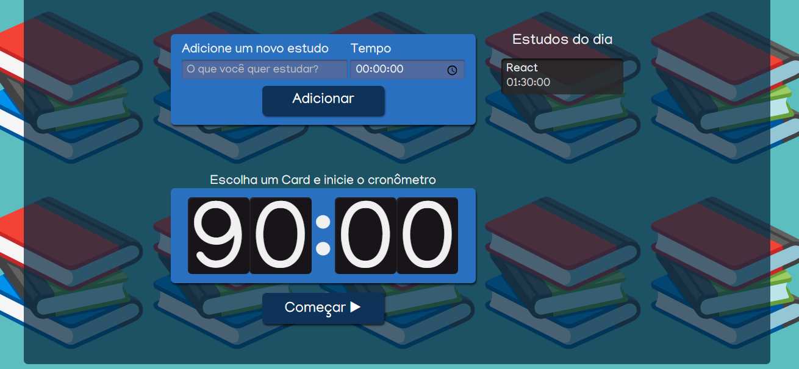
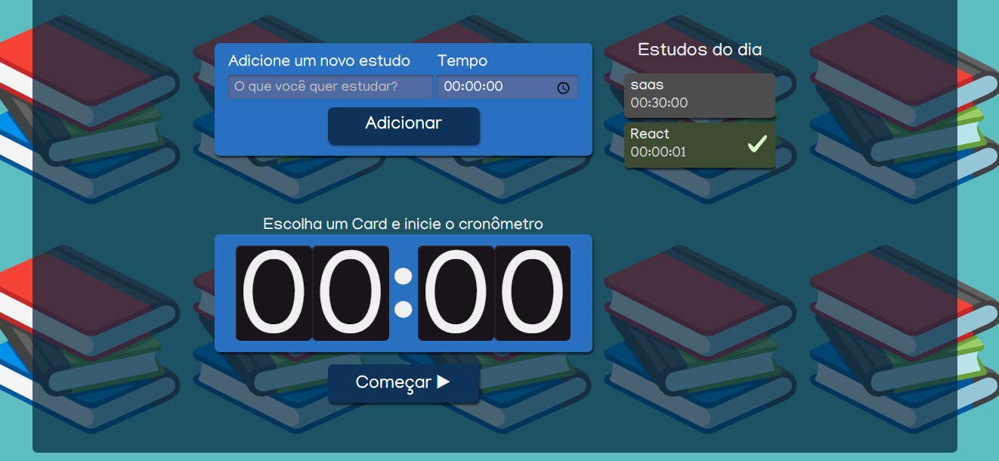

#   Studies

 Pagina desenvolvida no curso *REACT: ESCREVENDO COM TYPESCRIPT* da empresa [Alura](https://cursos.alura.com.br)

 [Certificado de conclusão 🚀](https://cursos.alura.com.br/certificate/Kauang13/react-modernizando-escrever-typescript)

 ## 🛠Tools 
 * React
 * Typescript
 * Sass

## Um Cronômetro ⏰ para te auxiliar com a sua gestão de tempo:

### te mostra o tempo em minutos necessário para finalizar a tarefa

### Sinaliza uma tarefa finalizada

### Com vesão mobile

